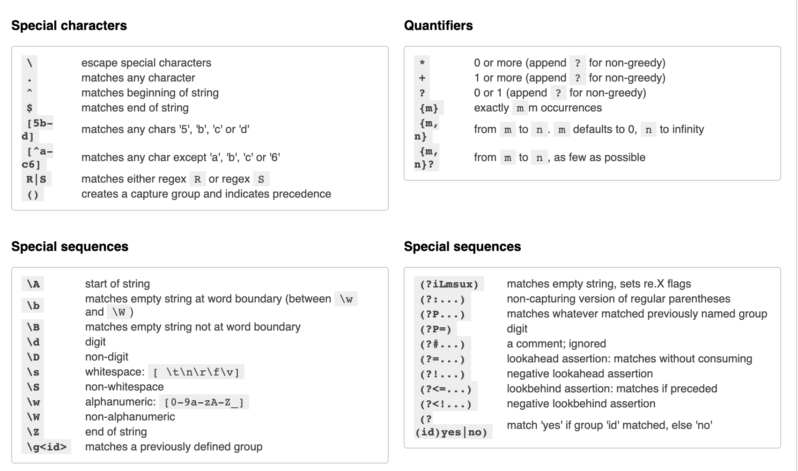

# Regular Expression syntaxes

```python
import re
# import torch
# from transformers import pipeline
from nltk import tokenize
```

### References

https://www3.ntu.edu.sg/home/ehchua/programming/howto/Regexe.html

https://docs.microsoft.com/en-us/dotnet/standard/base-types/regular-expression-language-quick-reference?redirectedfrom=MSDN

https://www.youtube.com/watch?v=sa-TUpSx1JA

### Cheat Sheet


#### Special Regex Characters

., +, *, ?, ^, $, (, ), [, ], {, }, |, \.


#### Escape Sequences (\char):

To match a character having special meaning in regex, you need to use a escape sequence prefix with a backslash (\). E.g., `\.` matches "."; regex `\+` matches "+"; and regex \( matches "(".

You also need to use regex `\\` to match "\" (back-slash).

Regex recognizes common escape sequences such as \n for newline, \t for tab, \r for carriage-return, \nnn for a up to 3-digit octal number, \xhh for a two-digit hex code, \uhhhh for a 4-digit Unicode, \uhhhhhhhh for a 8-digit Unicode.

#### OR Operator 

(|): E.g., the regex four|4 accepts strings "four" or "4".

### Character class (or Bracket List):

[...]: Accept ANY ONE of the character within the square bracket, e.g., [aeiou] matches "a", "e", "i", "o" or "u".

[.-.] (Range Expression): Accept ANY ONE of the character in the range, e.g., [0-9] matches any digit; [A-Za-z] matches any uppercase or lowercase letters.

[^...]: NOT ONE of the character, e.g., [^0-9] matches any non-digit.
Only these four characters require escape sequence inside the bracket list: `^, -, ], \`.

#### Occurrence Indicators (or Repetition Operators):

+: one or more (1+), e.g., [0-9]+ matches one or more digits such as '123', '000'.

*: zero or more (0+), e.g., [0-9]* matches zero or more digits. It accepts all those in [0-9]+ plus the empty string.

?: zero or one (optional), e.g., [+-]? matches an optional "+", "-", or an empty string.

{m,n}: m to n (both inclusive)

{m}: exactly m times

{m,}: m or more (m+)

Metacharacters: matches a character

`.` (dot): ANY ONE character except newline. Same as `[^\n]`

`\d, \D`: ANY ONE digit/non-digit character. Digits are [0-9]

`\w, \W`: ANY ONE word/non-word character. For ASCII, word characters are [a-zA-Z0-9_]

`\s, \S`: ANY ONE space/non-space character. For ASCII, whitespace characters are `[ \n\r\t\f]`

#### Position Anchors: 
Does not match character, but position such as start-of-line, end-of-line, start-of-word and end-of-word.

`^,$`: start-of-line and end-of-line respectively. E.g., ^[0-9]$ matches a numeric string.

`\b`: boundary of word, i.e., start-of-word or end-of-word. E.g., `\bcat\b` matches the word "cat" in the input string.

`\B`: Inverse of `\b`, i.e., non-start-of-word or non-end-of-word.

`\<, \>`: start-of-word and end-of-word respectively, similar to `\b`. E.g., `\<cat\>` matches the word "cat" in the input string.

`\A, \Z`: start-of-input and end-of-input respectively.

#### Parenthesized Back References:
Use parentheses ( ) to create a back reference.
Use $1, $2, ... (Java, Perl, JavaScript) or `\1, \2, ...` (Python) to retreive the back references in sequential order.

#### Laziness (Curb Greediness for Repetition Operators): 
*?, +?, ??, {m,n}?, {m,}?


```python
re.findall(r'[0-9]+','abc123add223')
```


    ['123', '223']


```python
re.findall(r'\d+','abc123add223')
```


    ['123', '223']


```python
re.findall(r'\D+','abc123add223')
```


    ['abc', 'add']


```python
# Try substitute: re.sub(regexStr, replacementStr, inStr) -> outStr
re.sub(r'[0-9]+', r'#', 'abc00123xyz456_0')
```


    'abc#xyz#_#'


```python
# Try substitute with count: re.subn(regexStr, replacementStr, inStr) -> (outStr, count)
re.subn(r'[0-9]+', r'<>', 'ab!!c00123xyz456_0')
```


    ('ab!!c<>xyz<>_<>', 3)


```python
# find person's age

text = "Prashant is 100 years old"

re.findall(r'[1-9][0-9]+', text)
```


    ['100']


```python
p1 = re.compile(r'^.+$', re.MULTILINE) 
```


```python
p1.findall('testing\ntesting\n')
```


    ['testing', 'testing']


```python
p1 = re.compile(r'abc+') 
```


```python
p1.findall('abcabcabc abcccc\nabcabcabcabc\n')
```


    ['abc', 'abc', 'abc', 'abcccc', 'abc', 'abc', 'abc', 'abc']


```python
p1 = re.compile(r'(invest|fund)+') 
p1.findall('Aleph invested in A,B,C\nThey also did some funding in Bitcoin\n')
```


    ['invest', 'fund']


```python
email_pattern = r"[a-zA-Z0-9]+@[a-zA-Z]+\.(com|edu|net|ie|in)"
```


```python
email_pattern_2 = r"[\w]+@[a-zA-Z]+\.(com|edu|net|ie|in)"
```


```python
user_email = "Prashant Garg's email id is prashant.rhel6@gmail.com"
```


```python
re.search(email_pattern, user_email)
```


    <re.Match object; span=(37, 52), match='rhel6@gmail.com'>


```python
re.search(email_pattern_2, user_email)
```


    <re.Match object; span=(37, 52), match='rhel6@gmail.com'>


```python
text = "Eden Shochat is an equal partner at Aleph VC, an early stage venture capital fund with $344 under management, focused on serving Israeli entrepreneurs who want to build scalable, global businesses. Since its founding in 2013, Aleph has invested in over 25 companies including WeWork, CommonSense Robotics, Lemonade, Windward, Honeybook and Nexar. Prior to founding Aleph, Shochat was a general partner at Genesis where he focused on seed-stage investments, was a co-founder of face.com, the world leader in massive, web-scale face recognition in social networks, acquired by Facebook in 2012. He was also co-founder and CTO of Aternity, where he led the strategic product direction for its dominant user-experience monitoring platform (acquired by Riverbed). Passionate about entrepreneurship, Eden founded The Junction which was voted as the #1 startup program in Israel, is a co-founder of the annual Geekcon conference and teaches entrepreneurship at the IDC (Herzeliya interdisciplinary center) Zell program."
```


```python
text
```


    'Eden Shochat is an equal partner at Aleph VC, an early stage venture capital fund with $344 under management, focused on serving Israeli entrepreneurs who want to build scalable, global businesses. Since its founding in 2013, Aleph has invested in over 25 companies including WeWork, CommonSense Robotics, Lemonade, Windward, Honeybook and Nexar. Prior to founding Aleph, Shochat was a general partner at Genesis where he focused on seed-stage investments, was a co-founder of face.com, the world leader in massive, web-scale face recognition in social networks, acquired by Facebook in 2012. He was also co-founder and CTO of Aternity, where he led the strategic product direction for its dominant user-experience monitoring platform (acquired by Riverbed). Passionate about entrepreneurship, Eden founded The Junction which was voted as the #1 startup program in Israel, is a co-founder of the annual Geekcon conference and teaches entrepreneurship at the IDC (Herzeliya interdisciplinary center) Zell program.'


```python
sentences = tokenize.sent_tokenize(text)
```


```python
sentences
```


    ['Eden Shochat is an equal partner at Aleph VC, an early stage venture capital fund with $344 under management, focused on serving Israeli entrepreneurs who want to build scalable, global businesses.',
     'Since its founding in 2013, Aleph has invested in over 25 companies including WeWork, CommonSense Robotics, Lemonade, Windward, Honeybook and Nexar.',
     'Prior to founding Aleph, Shochat was a general partner at Genesis where he focused on seed-stage investments, was a co-founder of face.com, the world leader in massive, web-scale face recognition in social networks, acquired by Facebook in 2012.',
     'He was also co-founder and CTO of Aternity, where he led the strategic product direction for its dominant user-experience monitoring platform (acquired by Riverbed).',
     'Passionate about entrepreneurship, Eden founded The Junction which was voted as the #1 startup program in Israel, is a co-founder of the annual Geekcon conference and teaches entrepreneurship at the IDC (Herzeliya interdisciplinary center) Zell program.']


```python
for sent in sentences:
    splits = re.split(r'\b(invest|sponsor|donat)\w*\b', sent)
    if len(splits)>1:
        print(splits)
```

    ['Since its founding in 2013, Aleph has ', 'invest', ' in over 25 companies including WeWork, CommonSense Robotics, Lemonade, Windward, Honeybook and Nexar.']
    ['Prior to founding Aleph, Shochat was a general partner at Genesis where he focused on seed-stage ', 'invest', ', was a co-founder of face.com, the world leader in massive, web-scale face recognition in social networks, acquired by Facebook in 2012.']


```python
text_2 = "321.555.4321"
text_3 = "321-555-4321"
text_4 = "222*555*4321"
```


```python
text_2
```


    '321.555.4321'


```python
pattern = r"\d\d\d[-.]\d\d\d[-.]\d\d\d\d"
```


```python
p1 = re.compile(pattern)
```


```python
p1.search(text_2)
```


    <re.Match object; span=(0, 12), match='321.555.4321'>


```python
p1.search(text_3)
```


    <re.Match object; span=(0, 12), match='321-555-4321'>


```python
p1.search(text_4)
```


```python
text_5 = "Mr. Sachin"
text_6 = "Mr Garg"
text_7 = "Mrs. Sharma"
text_8 = "Ms. Sejal"
```


```python
exprsn = r'M(r|s|rs)\.?\s[A-Z]\w+' # won't match Mr. T

exprsn2 = r'M(r|s|rs)\.?\s[A-Z]\w*' # will match both Mr. T and Mr. Tehran
```


```python
print(re.search(exprsn, text_5))

text_5 = "Hello Mr. Sachin,"

```

    <re.Match object; span=(0, 10), match='Mr. Sachin'>
    <re.Match object; span=(6, 16), match='Mr. Sachin'>


```python
# TO match these emails

# CoreyMSchafer@gmail.com
# corey.schafer@university.edu
# corey-321-schafer@my-work.net
```


```python
email_exprsn = r"[a-zA-Z0-9-.]+@[a-zA-Z-]+\.(edu|com|net)"
```

An example of very complex regular expression
```
\b(My|my)\s(favourite|favorite)\s([^.,]+).*?\b(is|was|have been|had been)\s([^.]+)
```